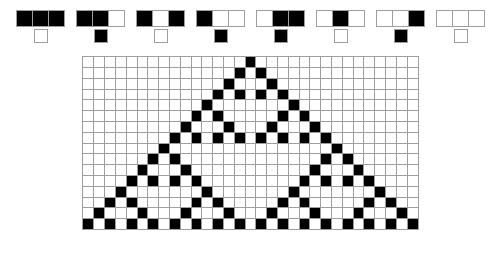
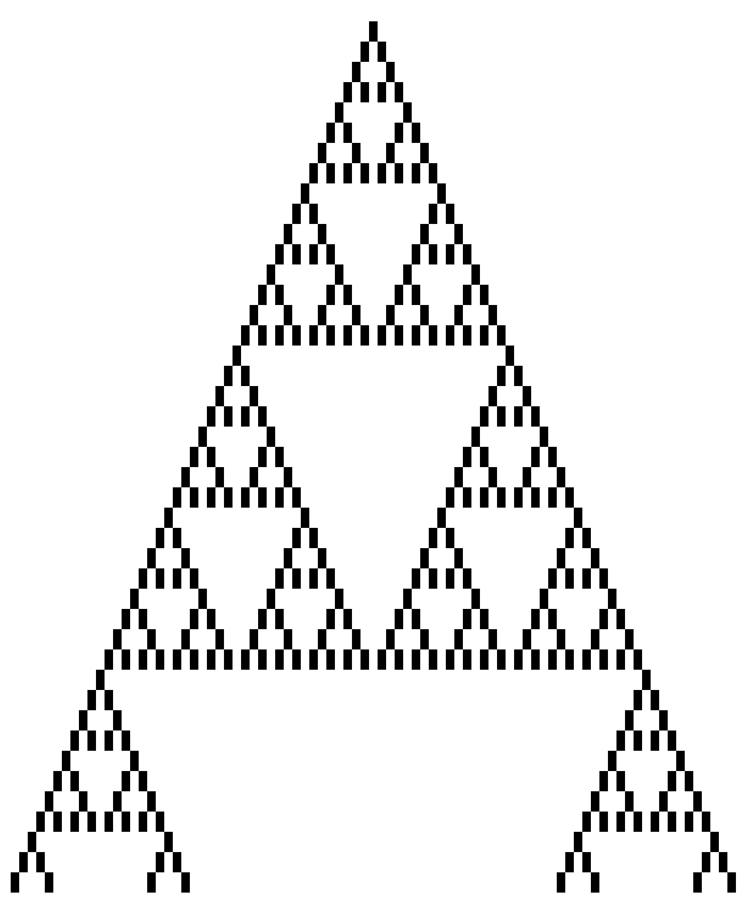
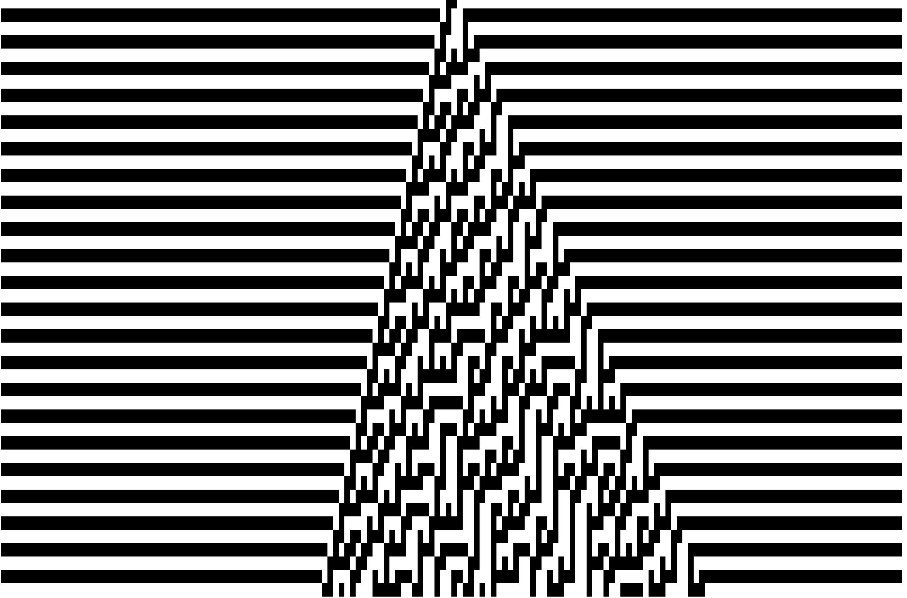
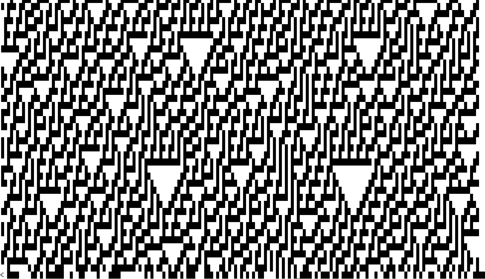
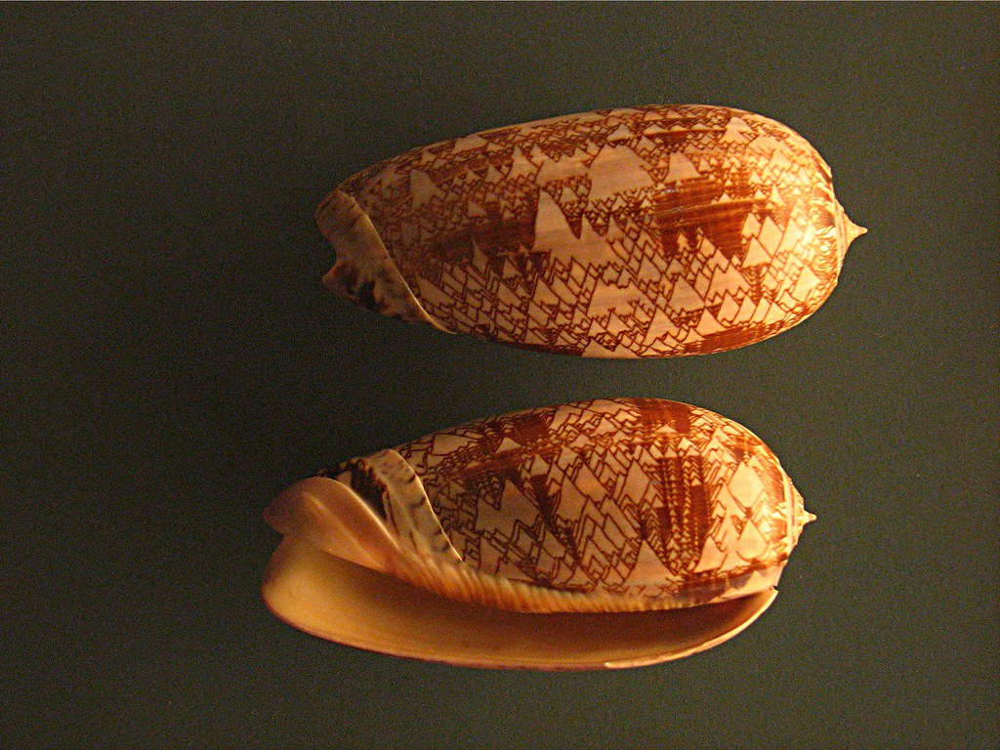
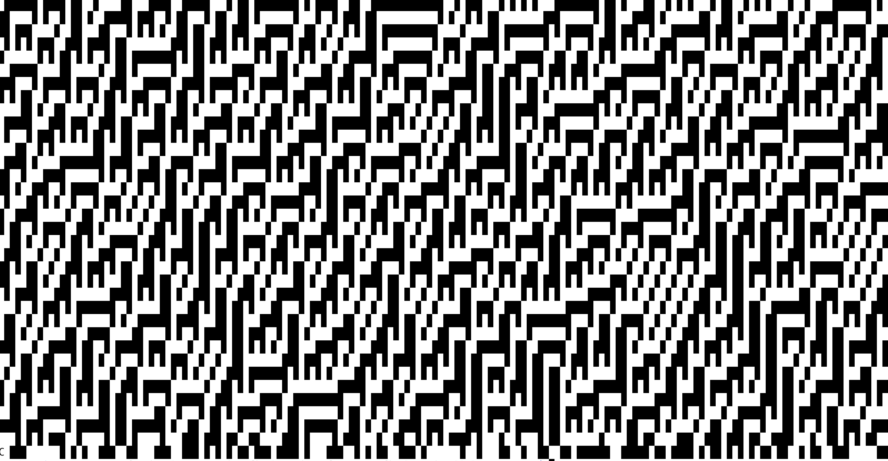
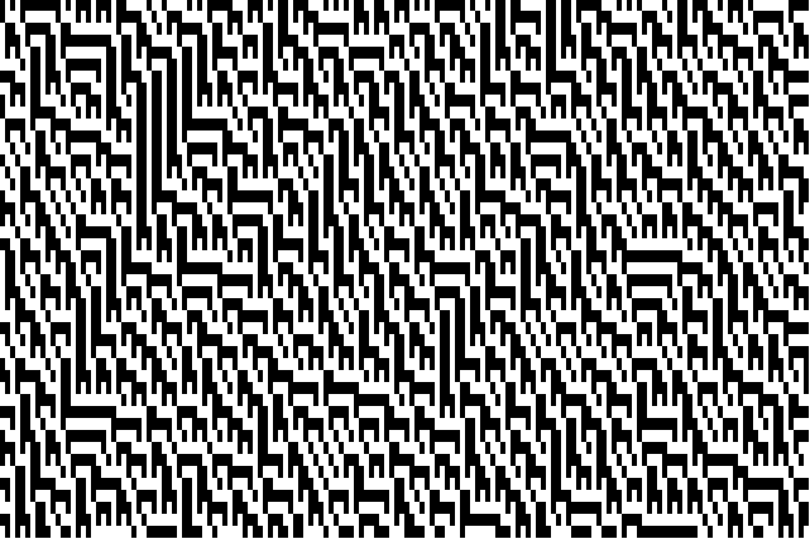
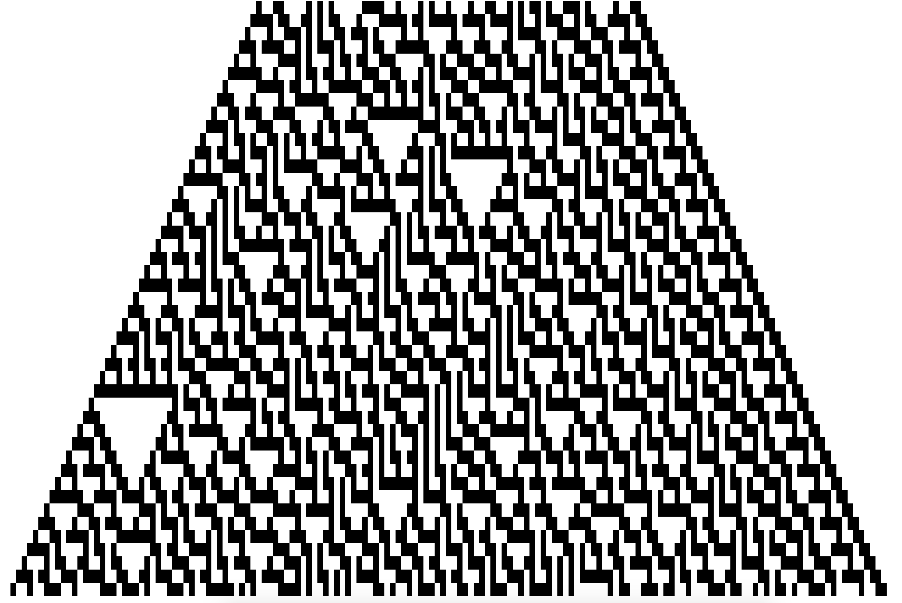

# func_prog_final_proj

## to Build
```
git clone https://github.com/ejdeposit/func_prog_final_proj.git
cd cellular-automata
stack install
```

add `~/.local/bin` to path or just  ` cd ~/.local/bin` before running the executable. 

## To Run
`cellular-automata-exe`
or 
`cellular-automata-app-input`

## About this Project

### Project Goals
I wanted to do a project on Cellular automata or the Game of Life after talking about them in my AI class. After realizing that all the code for the Game of Life is in the textbook I decided to do Cellular automata.  The goal of this project was to implement Cellular automata program and include a suite of of unit tests that I would use for test driven development during the development of this project. 

### Organization

The cellular automata project is contained within the `cellular automata` directory.  The `game_of_life` contains the Game of Life functions from the text book.  These same functions can also be found within `src/GameOfLifeLib.hs` within the`cellular automata`. `my-haskell-app` contains the Stack tutorial that I completed prior to starting the project.  

### Starting out
I started by implementing the Game of Life code from the textbook.  This gave me some ideas for how to represent live cells using Haskell.  I think that if I was using another language my first instinct would be to make two dimensional array of Boolean values.  However, the Game of Life from the text book just kept a list of live cells, where each element of the list is tuple for the x and y coordinates.    After I ran the game of life by just initiating a function call from the interpreter, but it was rather slow.

Next, I decided I wanted to use Stack to manage my project because that was what seemed to work best when completing the course homework.  I wanted to first figure out how to implement my own project folder, so I completed the tutorial on the stack Github page.  This led me through the steps of how to create different libraries for my functions in the `src` folder, and how to run a program with user input through a main function.  It also guided me through how to set up unit tests using the Hunit that can be run using the `stack test` command.  I then modified the main program from the stack project I had created to run the Game of Life simulation, and was surprised by how much faster it ran as a compiled executable rather than from a function call to the interpreter.   

### Cellular Automata
My first goal for implementing a Cellular Automata was to create a program that generated the repeating triangle fractal pattern.  The example can be seen in the figure below.

   
**Triangle Pattern With Rules**

I decided to use this same method as the game of life for storing the living cells as a list, but since the cellular automata are 1 dimensional I just kept a list of `Ints` to represent the live cells. 

I was able to modify the `neighbs` and `wrap` functions from the Game of to get a list of neighbors for each cells.  The wrap function returns cells from opposite ends of the line of cells when you try to get the neighbors of a cell on the end of the line of cellular automata.  

The `getNeighbors` function for the cellular automata returns a list of `Int`s that are the neighbors for the specified cell. This function is used by the `hasNeighbors` function which then converts the list of neighbors into a list of `Bool`s to indicate if the specified cells has neighbors.  This list of `Bool`s is then the input for the `pyramidRules` function which returns true if a cell should be alive next round and false if it should be dead.  The `nextGeneration` function uses filter to apply these functions over each cells in the current generation and returns the list of living cells in the next generation.  separately.   

### Output of Cellular Automata
I modified the print function of the Game of Life which use the `goto` function to move the cursor to the correct coordinate position on the screen.  Initially I just just had it go to the correct x coordinate and then kept the y-coordinate as 1, but this resulted in the output always being off the screen because the results were cleared after each line was printed.  I really wanted to be able to watch the triangles form as they are printed, so instead of just coping the game of life printing functions I had to spend some time looking up better escape sequences to use to move the cursor for the cellular automata to the correct place on the screen before printing each live cell.  The results can be seen in the `writeAt` function.  The game of life function prints a 'O' for each living cells, but I changed that to a solid black square.   


**Example output of cellular-automata-exe**

### Testing
I created more functions that is really necessary in that some of these functions could easily be combined into a single function, but I decided to split them up to make the code more modular so that I could test each thing individually as much as possible 

All unit tests are contained within `func_prog_final_proj/cellular-automata/test/LibTests.hs`.  I'd like to say that I was practicing test driven development, but the truth I'm probably not proficient enough in Haskell to rely solely on tests to develop my functions.  I end up using the interpreter to get more immediate feedback on which things I was trying were working or not.  The functions that I tested using the interpreter can be seen in the `func_prog_final_proj.scratchWorl.hs`. Once I felt like I got a function working based on my results in the interpreter I would add a wider range of test cases to test the same function out in `LibTets.hs`.  This helped ensure that functions like `wrap` return the correct neighbors when the cells were on the end.

### Adding User Input

To go further with my project I wanted to create a version of the project that allowed you the user to select which set of rules to have the cellular automata use rather than have the rules hard coded.  I use the functions `filterM` and `powerset` from the textbook to generate a power set of the list [1...8].  These lists of numbers from 1 to 8 are then converted into lists of Booleans, where the ith element of the list is True if the number is in in the original list and false otherwise.  This creates a list with all the combinations of True and false that are 8 long.  The user is then able to select on of this lists of Booleans which is then passed to the `genRules` function which then returns a function that uses the rules that the user selected so that any elementary cellular automata can be generated. However, I quickly discovered a lot of the cellular automata are pretty boring.  I created some functions to allow the user to generate different starting seed configurations.  Originally,  the only starting configuration was having the middle cell alive.  The new functions allowed the user to select which different combinations of the cells are alive in the first generation for the center cells and its immediate neighbors.  However,  adding this didn't have any impact on the patterns that were generated. 


<!--  -->






<!--  -->




<!--  -->

To see a full list of the patterns available go to
[mathworld.wolfram.com](https://mathworld.wolfram.com/ElementaryCellularAutomaton.html)